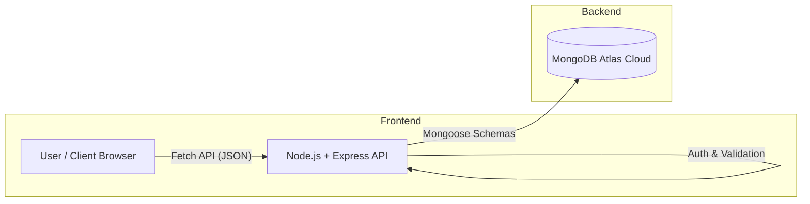

# 🎨 DesignEase — The Ultimate Creative Workspace

> **Create stunning digital documents, manage secure projects, and control team access with ease.**


-blueviolet?style=for-the-badge)


---

## 📖 **Overview**

**DesignEase** is a full-stack creative platform designed to streamline digital asset creation and organization. It features a robust **Drag-and-Drop Editor** for creating posters and resumes, paired with a secure **Project Management System** backed by MongoDB Atlas.

Unlike typical tools, DesignEase focuses on **Granular Access Control**, allowing owners to invite members to specific workspaces via secure **One-Time Access Codes**.

---

## 🏗️ **System Architecture**

High-level data flow of the application:



✨ **Key Features**

---

## 🎨 Creative Editor (`editor.html`)
- **Drag-and-Drop Canvas** – Intuitive interface using Fabric.js to add text, shapes, and images  
- **Professional Templates** – Pre-built layouts for Resumes and Social Media posts  
- **Export Engine** – Download designs instantly as **PDF**, **PNG**, or **JPG**  
- **Rich Media** – Upload local images or generate assets via AI tools  

---

## 🔐 Team Access & Invites (`invite.html`)
- **Secure Workspace Sharing** – Share specific project folders without exposing your entire account  
- **One-Time Access Codes (OTP)** – Generate unique 6-character codes that expire after use  
- **Role Management**
  - **Owners** – Create folders, generate codes, and revoke access  
  - **Members** – Join folders via code to view/edit content  
- **Revoke System** – Instantly remove a user's access to a folder  

---

## 🗄️ Cloud Data Management (`projects.html`)
- **MongoDB Atlas Integration** – All folders, user data, and permissions are stored in the cloud  
- **Persistent Storage** – Design metadata and user sessions persist across reloads  
- **Scalable Schema** – Structured data models for *Users*, *Folders*, and *AccessCodes*  

---

## 🤖 AI & Planning Tools
- **AI Image Generator** – Create unique visuals using text prompts  
- **Content Planner** – Calendar view to schedule and organize design publication  

---

## 🛠️ Tech Stack

| Layer     | Technology                | Usage |
|-----------|---------------------------|-------|
| Frontend  | HTML5, CSS3, JavaScript   | Glassmorphism UI, Canvas manipulation, DOM logic |
| Backend   | Node.js, Express.js       | REST API routing, Authentication, Logic handling |
| Database  | MongoDB Atlas             | Cloud NoSQL database for flexible data storage |
| Security  | CORS, Body-Parser         | API security and data parsing |

---

## ⚙️ Installation & Setup Guide

### 1️⃣ Prerequisites
- Node.js (v14 or higher)  
- Code Editor (VS Code recommended)  
- Git (optional)  

### 2️⃣ Clone the Repository
```bash
git clone https://github.com/Piyush79432/DesignEase.git
cd DesignEase
```
### 3️⃣ Install Backend Dependencies
```bash
npm install express mongoose cors body-parser
```
### 4️⃣ Setting Up MongoDB Atlas

1. Create an account at **MongoDB Atlas**  
2. Create a **Shared (Free)** cluster  
3. Create a database user from **Database Access**  
4. Allow network access from `0.0.0.0/0` or your IP  
5. Copy the MongoDB connection string from **Connect > Drivers**

---

### 5️⃣ Configure Server

Open `server.js` and update the MongoDB URI:

```javascript
// server.js
const MONGO_URI = "mongodb+srv://<username>:<password>@cluster0.mongodb.net/designease?appName=Cluster0";
```

### 6️⃣ Run the Application

#### Start Backend
```bash
node server.js
```
**Expected Output:**
🚀 Server running on http://localhost:5000  
✅ Connected to MongoDB Atlas  

### Start Frontend
Open `index.html` or `home.html` using a local server such as **Live Server** in VS Code.


## 📂 Project Structure
```text
DesignEase/
│
├── public/ # Assets (Images, Icons, Styles)
│
├── server.js # Main Backend (Express + Mongoose)
│
├── index.html # Landing Page & Login
├── home.html # Main User Dashboard
├── editor.html # Creative Design Canvas
├── projects.html # Folder Management
├── invite.html # Team Invites & Access Control
├── templates.html # Template Gallery
├── ai-generator.html # AI Tools
├── content-planner.html # Calendar Tool
```
